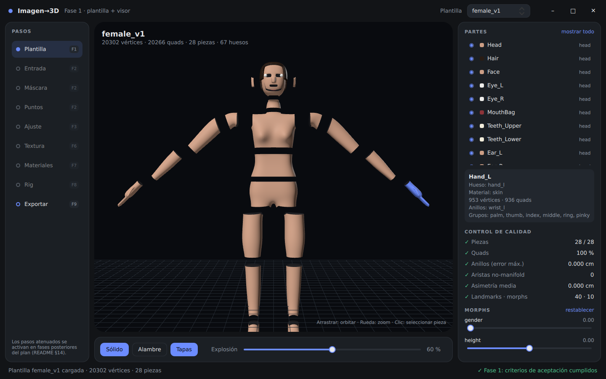
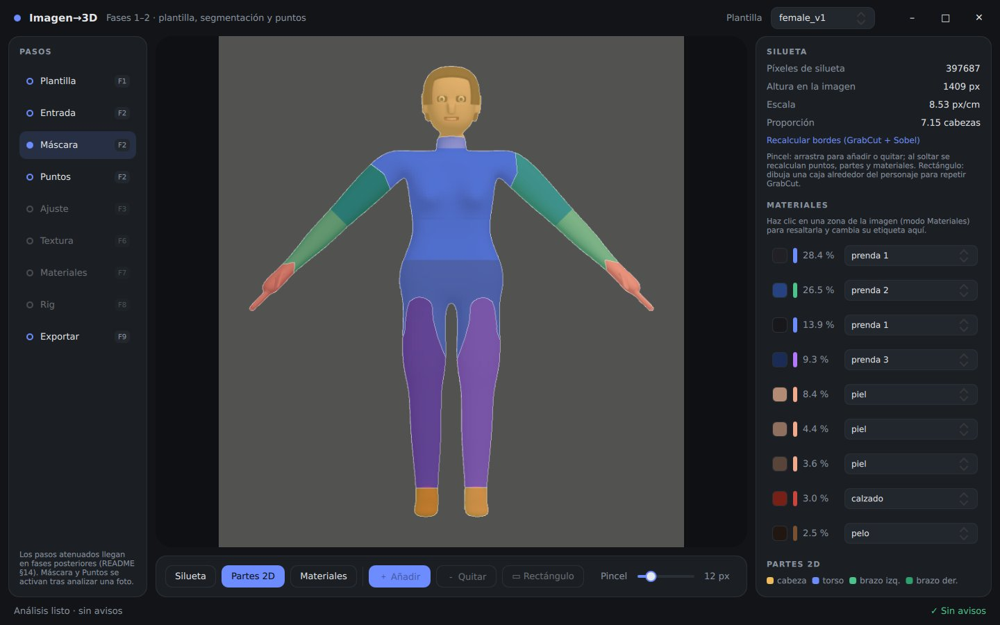

# img2char · Imagen → personaje 3D por partes

Programa de escritorio que convertirá imágenes de un personaje en un modelo 3D **modular**
(28 piezas que encajan por anillos compartidos, quads, UV, PBR, rig con nombres de UE5) usando
sólo geometría y visión por computadora clásica. El diseño completo está en
[`docs/DISENO.md`](docs/DISENO.md); las secciones (§) de este README se refieren a ese documento.





## Estado

| Fase (§14) | Estado |
|---|---|
| **1. Plantilla + visor** | ✅ Hecha: plantillas `male_v1`/`female_v1`, 28 piezas, anillos, tapas, landmarks, 10 morphs, esqueleto UE5, UV, export `.glb` + `manifest.json`, app con visor |
| **2. Segmentación + landmarks** | ✅ Hecha: máscara (GrabCut + Sobel), 22 landmarks y esqueleto 2D, 10 partes 2D, zonas de material, cámara ortográfica, editor manual (pincel, rectángulo, puntos arrastrables, etiquetas de material) |
| 3–11 | Pendiente |

Criterios de aceptación de la fase 1, comprobados por `img2char templates check` y los tests:
las 28 piezas cargan en el visor, los anillos coinciden a **0,0 cm** y la malla es **100 % quads**
(además: sin aristas no-manifold, orientación coherente, simetría exacta).

### Fase 2: resultados medidos

Sin fotos reales en el repositorio, la fase 2 se mide como propone §14: fotos **sintéticas**
renderizadas desde la plantilla, con ropa de colores lisos y morphs aleatorios, cuya verdad terreno
(máscara, puntos, pieza y material por píxel) es exacta. Peor caso sobre 10 fotos (M/F, semillas
distintas):

| Medida | Resultado | Criterio |
|---|---|---|
| IoU de la máscara (GrabCut + Sobel) | ≥ 0,987 | — |
| Error de cada landmark | ≤ 1,8 % de la altura | < 2 % (§14) |
| Partes 2D correctas | ≥ 0,95 global; manos y pies ≥ 0,70 | — |
| Materiales (piel / pelo / prenda / calzado) | ≥ 0,99 / 0,98 / 0,99 / 0,91 | — |
| Escala px/cm | ±1 % | — |
| Tiempo de análisis (1600 px) | ~1,5 s | — |

Manos y pies son lo más flojo de las partes 2D porque miden un 5–6 % de la altura: un error de
muñeca o tobillo del 1,5 % mueve un 20 % de sus píxeles a la parte vecina. **Pendiente de
verificar**: la otra mitad del criterio de §14, *< 30 s de corrección de máscara en 20 fotos
reales*, necesita esas fotos.

Limitaciones del detector: espera la vista frontal en pose A/T con los brazos despegados del
cuerpo. Si no encuentra algo (brazos pegados, piernas juntas) usa proporciones por defecto, marca
esos puntos en rojo y muestra un aviso para corregirlos a mano.

### Plantilla provisional

El documento recomienda partir de la malla base de MakeHuman (CC0). Hasta que ese activo esté
preparado (marcar `part_id`, anillos y landmarks a mano en Blender), las plantillas se generan **por
código** (`core/template/procedural.py`). Es un maniquí de quads modelado con extrusiones (box
modeling), dos niveles de Catmull–Clark y un tercero tras añadir ojos, nariz, boca, orejas y dedos.
Masculino y femenino comparten topología exacta porque todas las selecciones geométricas se calculan
una vez y se reproducen por índice. Los morphs son diferencias finitas del propio generador.

Limitaciones conocidas de esta plantilla: ~20 k vértices (el objetivo para la definitiva es 25–40 k),
rasgos faciales simplificados, pelo como casco y UV por proyección cilíndrica/plana. LSCM llega en
la fase 6. Cuando exista la plantilla MakeHuman bastará con guardarla en el mismo formato.

## Instalación

```bash
cd Tools/img2char
python -m venv .venv && . .venv/bin/activate      # Windows: .venv\Scripts\activate
pip install -e ".[ui,dev]"
```

Requiere Python ≥ 3.10. La UI usa PySide6 ≥ 6.5 (Qt Quick 3D, `MultiEffect`, `DebugSettings`).

## Uso

```bash
img2char templates build                 # genera templates/male_v1 y templates/female_v1 (~5 s)
img2char templates check female_v1       # control de calidad (código de salida 1 si falla)
img2char export female_v1 --out out/ --morph height=-0.5 --morph fat=0.3
img2char synth female_v1 --out out/prueba.png --morph fat=0.5   # foto de prueba + verdad terreno (.json)
img2char analyze out/prueba.png --height 165 --out out/analisis # fase 2: máscara, puntos, partes, materiales
img2char ui                              # aplicación de escritorio
pytest                                   # tests
```

`export` escribe `character.glb` (un nodo por pieza, metros, Y arriba, tapas como segunda
primitiva), `manifest.json` (formato §2: partes, anillos, grupos, costuras) y `report.json`.
`analyze` escribe `mask.png`, `materials.png`, `parts2d.png`, `overlay.png` y `analysis.json`
(puntos, confianza, cámara, materiales y avisos). La UI genera las plantillas automáticamente la
primera vez.

### Aplicación

Ventana sin marco con el tema de §12.3. Los pasos del pipeline están a la izquierda y los de fases
futuras aparecen atenuados.

- **Plantilla** (fase 1): visor 3D (orbitar, zoom, clic para seleccionar), sólido/alambre, tapas,
  vista explosionada, piezas visibles, detalle de pieza, control de calidad, morphs en vivo y
  exportación.
- **Entrada**: ranuras arrastrar-y-soltar (frontal obligatoria; lateral, trasera y rostro para la
  fase 4), altura en cm, balance de blancos y "usar foto de prueba".
- **Máscara**: silueta, partes 2D o materiales sobre la foto. Pincel añadir/quitar, rectángulo de
  GrabCut y "recalcular bordes". Clic en una zona para resaltarla y cambiar su tipo de material.
- **Puntos**: landmarks y esqueleto 2D arrastrables, guías de cabezas, colores por confianza
  (detectado / por proporción / movido a mano) y restablecer.

El trabajo pesado corre en un hilo aparte. Al editar la máscara se vuelven a detectar los puntos,
conservando los movidos a mano. Al mover un punto se recalculan las partes 2D.

## Formato de plantilla (`templates/<nombre>/`)

| Archivo | Contenido |
|---|---|
| `mesh.npz` | `V0` (n,3) cm, `F` (m,4), `part_id` (m,), `uv`, `uv_faces`, `mirror` (n,) |
| `parts.json` | tabla de partes (§2): bloque, hueso, material, grupos, blendshapes |
| `rings.json` | anillo → partes `a`/`b` (`b = null` en agujeros: cuencas de los ojos) y bucle ordenado |
| `landmarks.json` | 40 landmarks como índices de vértice |
| `morphs.json`, `morphs/*.npy` | 10 morphs (K,n,3) con rango y unidad |
| `skeleton.json` | 67 huesos con nombres del maniquí de UE5 y posición = centroide de anillo (§10.2) |
| `groups.json` | caras de `palm/thumb/index/middle/ring/pinky` y `heel/body/toes` |
| `loops.json`, `meta.json` | bucles auxiliares (falanges, ojos, bola del pie) y metadatos |

Ejes: Y arriba, frente +Z, izquierda del personaje +X (sufijo `_L`), simetría respecto a X.

## Estructura

```
img2char/
├─ cli.py, pipeline.py         # CLI y orquestador (Job, pasos y fase de cada uno)
├─ app/                        # PySide6 + QML (main.py, photo.py, qml/*.qml)
└─ core/
   ├─ mesh/                    # QuadMesh (extrusión, puentes, rejillas), Catmull–Clark, QA
   ├─ template/                # partes, generador procedural, anillos, UV, esqueleto, formato
   ├─ parts.py                 # división en piezas, tapas, vista explosionada, informe de calidad
   ├─ export/                  # glTF (.glb) y manifest.json
   ├─ preprocess.py            # EXIF, reescalado a 2048 px, gray-world, bilateral
   ├─ segment.py               # GrabCut, refinado Sobel, Canny, pincel, IoU
   ├─ landmarks.py             # perfil de anchura, seguimiento de extremidades, cara
   ├─ regions.py               # partes 2D (hueso más cercano + watershed) y materiales (k-means + reglas)
   ├─ cameras.py, analyze.py   # cámara ortográfica y orquestación de la fase 2
   ├─ overlays.py              # imágenes de superposición para UI y CLI
   └─ synth.py                 # fotos sintéticas con verdad terreno para los tests
tests/                         # malla, plantilla, piezas, export, CLI, fase 2 (sintética)
```
